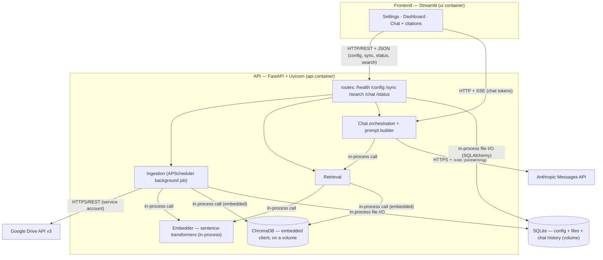

# RAG Knowledge Base — Google Drive + Claude

A production-quality Retrieval-Augmented Generation system. It ingests PDFs from a
Google Drive folder, embeds them into an open-source vector store, and answers
questions in a **streaming chat that is grounded only in the retrieved documents,
with citations** (document + page) and an honest "not in the knowledge base"
fallback.

- **API:** http://localhost:8000 — `/docs` for the OpenAPI UI
- **UI:** http://localhost:8501 — Settings · Dashboard · Chat

---

## 1. Architecture overview

Five logical services. To keep a solo build lean, two of them are **co-located in
the API process** (the ingestion worker runs as an in-process APScheduler job, and
ChromaDB runs **embedded** as a library on a mounted volume) — the brief explicitly
allows this, and the code stays modular so separation of concerns is real. There
are two containers: **`api`** and **`ui`**.



**Protocols:** UI↔API is HTTP/REST + JSON, except chat which is **SSE**
(`text/event-stream`). API→Drive is HTTPS/REST (service account). API→Anthropic is
HTTPS + SSE streaming. The embedder, embedded Chroma, and SQLite are **direct
in-process library calls** (no network hop) — the cheapest correct option since
none needs to be independently scaled here.

**End-to-end flow:** PDFs in a Drive folder → ingestion pulls them over HTTPS →
PyMuPDF extracts text per page → a token-aware overlapping chunker splits it →
sentence-transformers embeds each chunk → chunks + metadata go into ChromaDB → a
question is embedded the same way → top-k chunks come back → they're wrapped in a
grounding prompt → Claude streams an answer → tokens are re-streamed to the UI over
SSE with a citation list.

### Layout
```
api/   FastAPI; also runs ingestion + embedder + embedded Chroma + SQLite
  main.py · config.py
  routes/       health · config · sync · search · chat · status
  ingestion/    drive_client · pdf_parser · chunker · sync_diff · pipeline · scheduler
  embeddings/   embedder (sentence-transformers)
  vectorstore/  chroma_store (embedded PersistentClient, cosine)
  llm/          prompt_builder · claude_stream (Messages API streaming)
  db/           models (Config · FileRecord · ChatMessage) · session · crud
  tests/        40 tests
  scripts/      chunk_inspect.py
ui/    streamlit_app.py (Settings · Dashboard · Chat)
```

## 2. Technology choices and justification

**Vector DB — ChromaDB, embedded.** It's the lowest-friction open-source store
that does everything required: stores embeddings *with* arbitrary metadata,
supports `where` metadata filtering, persists to disk, and has a clean Python
client. Running it **embedded** (`chromadb.PersistentClient(path=…)`) means no extra
container and no network hop, while a mounted volume keeps data across restarts.
Cosine space is used so relevance score = `1 - distance`. *(Qdrant or Chroma server
mode are the scale-up answers; see §5.)*

**Embedding model — local `sentence-transformers` `all-MiniLM-L6-v2` (384-dim).**
Free, runs entirely in-container with no external dependency or rate limit, and is
fully aligned with "open-source only." **Claude is not an embedding model** — Anthropic
exposes no embeddings endpoint — so embeddings are computed locally (Voyage AI is the
paid alternative, exposed as a future option). The same model is used for indexing
and querying (a hard invariant; changing it requires a full re-index).

**Chunking — token-aware sentence-window with overlap, page-tracked.** Text is split
into sentences and packed into windows measured in the **embedding model's own
tokens**, with ~15% overlap, snapping to sentence boundaries and tracking
`start_page`/`end_page`. Size is **clamped to the model's max (256 for MiniLM)** —
larger chunks would be silently truncated by the model before embedding, dropping
each chunk's tail. Overlap is mandatory so a sentence straddling a boundary appears
whole in at least one chunk. Both size and overlap are configurable
(`chunk_tokens`, `chunk_overlap`) and a larger-context model raises the effective
size automatically.

**Frontend — Streamlit.** The entire UI (settings, live sync dashboard, streaming
chat with citations) is pure Python with no second build system, no separate
frontend container, and no CORS. It consumes the FastAPI endpoints over HTTP and
reads the `/chat` SSE stream into `st.write_stream` for token-by-token output, so
the required "API consumed by the UI" separation holds.

*(Also: FastAPI + Uvicorn for async I/O and clean SSE; SQLite via SQLAlchemy for
config/sync-state/chat-history, separate from the vector store; APScheduler for
in-process background ingestion; SSE over WebSocket because token streaming is
one-directional.)*

## 3. Setup

**Prerequisites:** Docker Desktop. A Google Cloud **service account** with the Drive
API enabled, and a Drive folder of PDFs **shared with the service account's email**.
An Anthropic API key.

1. **Service account:** in Google Cloud, create a service account, enable the **Google
   Drive API**, create a JSON key, and **share your Drive folder with the service
   account's `client_email`** (Viewer is enough).
2. **Environment:** `cp .env.example .env`. You can set `ANTHROPIC_API_KEY` here, or
   enter it in the UI. Real secrets never go in git — only `.env.example`
   (placeholders) is tracked.
3. **Run:** `docker compose up --build` (first build is slow — it pulls torch +
   chromadb).
4. **Configure (in the UI, http://localhost:8501 → Settings):** paste the Drive
   **folder ID**, upload the **service-account JSON**, set the **Anthropic key** and
   **top-k**, and Save. Secrets are stored server-side (SQLite) and shown masked.

Credentials can alternatively be provided via files: drop the JSON at
`./secrets/service_account.json` (gitignored) and set `DRIVE_FOLDER_ID` in `.env`.

## 4. How to use

1. **Settings** — set the Drive folder ID, service-account JSON, Anthropic key, top-k.
2. **Chat** — click **Sync now** (top of the page) to ingest; the **last auto-sync**
   time shows next to it. Re-syncing skips unchanged files; editing a file re-embeds
   only it; deleting removes its chunks. A background **auto-sync runs every 15 minutes**
   (configurable via `AUTO_SYNC_MINUTES`). Then ask a question — the answer streams
   token-by-token, grounded only in your documents, with a **Sources** panel mapping
   each `[n]` marker to its document and page. Out-of-corpus questions get an honest
   "not in the knowledge base" reply; conversations are multi-turn within a session.
3. **Dashboard** — live status: documents, chunks, last sync, per-file errors.

A `/search` endpoint is available independently for testing retrieval
(`POST /search {"query": "...", "top_k": 5}`).

## 5. Known limitations & what I'd do differently

- **Embedding model isn't hot-swappable** — changing it requires a full re-index
  (different vector space/dimension). It's stored in config and used by the pipeline,
  but switching needs a manual reset. A guided "change model → re-index" flow is the
  improvement.
- **Scanned / image-only PDFs** are detected and flagged `no_extractable_text` (sync
  continues) but not OCR'd. Adding Tesseract (`pytesseract`) would ingest them.
- **No re-ranking layer** — a cross-encoder re-rank after top-k would lift retrieval
  quality (a named bonus).
- **Service-account auth only** — OAuth 2.0 user flow is a bonus not implemented.
- **PDF only** — DOCX support (`python-docx`) behind the same pipeline is a bonus.
- **In-process APScheduler** — no durable task queue; a crash mid-sync loses
  in-flight job state. Per-file state is persisted, so a re-run resumes cleanly;
  Celery + Redis is the scale-up.
- **SQLite single-writer** — fine here; Postgres/pgvector is the consolidation play.
- **More time:** Qdrant or Chroma-server for stricter service boundaries and scale,
  a streaming sync-progress bar (reusing the SSE plumbing), and a query-rewrite step
  for multi-turn retrieval.

## 6. Reflection on Claude Code

**Where it helped most.** Scaffolding the modular two-container project and the
ingestion pipeline was fast and accurate. The biggest wins came from **multi-agent
review**: an adversarial review of the Day-1 scaffold caught per-service
`.dockerignore` gaps that could have leaked secrets, and the Phase-4 review caught a
real multi-turn bug (a windowed chat history could start with an `assistant` turn
and be rejected by the Messages API). A dedicated **prompt-engineer agent** hardened
the grounding prompt (untrusted-context framing, exact refusal, conflicting-source
handling). Custom tooling paid off: a secret-scan pre-commit hook, ruff format-on-
save, a `/chunk-inspect` tool, and the Playwright + SQLite MCPs for verifying the UI
and inspecting state.

**Where it fell short / suggestions that were wrong.** It needed a human decision on
the chunk-size-vs-model conflict (the plan's ~800-token chunks would be silently
truncated by MiniLM's 256-token limit — we sized chunks to the model instead). A
first attempt at a chat test made a *real* Anthropic call because the empty key fell
back to the env key — it had to be reworked to force the no-key path. Environment
friction surfaced too: `chromadb.EphemeralClient()` is a process singleton (tests had
to use unique collection names), and Git Bash mangled `/tmp` paths into Windows
paths. Lesson: treat generated code and "looks done" claims as hypotheses — run it,
test it, and adversarially review it before trusting it.

---

## Tests

```bash
docker compose run --rm api pytest          # or, in a venv from ./api: pytest
```
**71 tests** (captured in [docs/test-report.txt](docs/test-report.txt)) cover:
- **Unit / integration:** chunking (count/overlap/size/page-spans/short/empty),
  embedding (dimension/determinism/batch), retrieval (relevance/top-k/filter/delete),
  the sync diff (incl. modifiedTime fallback), Drive folder-id parsing, `/search`,
  `/chat` (prompt builder, citations, no-context guard, SSE shape, history sanitizer,
  threshold guard), and `/config` (masking, validation).
- **End-to-end** (`tests/test_e2e.py`, only Drive + the Anthropic stream faked):
  full sync (parse → chunk → embed → store) with scanned-PDF flagging and table
  extraction; `/search`; grounded `/chat` with citations; no-context refusal;
  mid-stream error over SSE; multi-turn history replay; incremental sync
  (unchanged/modified/renamed/deleted); `/sync` pre-flight 422s; Drive auth-failure
  error dict; persistence across a client reopen; and the embedding-model re-index guard.

## Tooling (Claude Code)

Hooks (secret-scan on commit, ruff format-on-save), custom skills (`/rag-eval`,
`/chunk-inspect`), custom agents (`prompt-engineer`, `rag-evaluator`,
`edge-case-hunter`), and MCP servers (Playwright, SQLite, Google Drive). See
`CLAUDE.md` for details.
