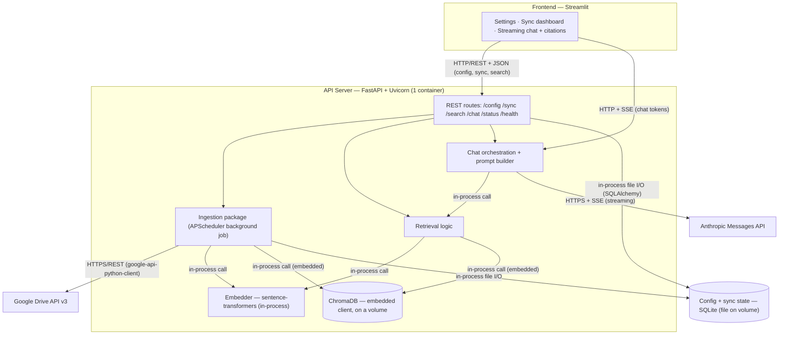

# RAG Knowledge Base — Build Plan & Architecture Report
### Pole Star Global · Claude Code Track · 5-Day Assignment

This is a planning document, not the README you'll submit. It locks down the architecture, the tech stack and *why* each piece was picked, the exact data that moves between services (the payloads), the protocols on each wire, how every edge case is handled, and a phase-by-phase build order mapped to the 5 days. Everything here stays inside the fixed constraints in the brief — nothing here violates a "must" — and the choices are weighted for the **5-day deadline**: where a simpler option costs little, it wins.

Quick map of what's covered:

1. The system in one picture (diagram + protocols)
2. Tech stack: every choice, the reason, and the trade-offs
3. Constraint compliance (how this maps to the brief's fixed rules)
4. End-to-end data flow (the full lifecycle)
5. Protocols & how services talk to each other
6. Payloads (concrete JSON/code for every interface)
7. The RAG prompt: grounding, citations, no-context guard, multi-turn
8. Incremental sync + edge cases (deleted/edited/added docs, failures)
9. The phased build plan (Phase 0 → 6, mapped to Days 1–5)
10. Testing plan (the 10+ tests, mapped to the rubric)
11. Bonus opportunities
12. Rubric alignment
13. Repo structure + Docker Compose + `.env.example`

---

## 1. The system in one picture

Five logical services, exactly as the brief asks. To keep the container count low for a solo 5-day build, two services are co-located in the API process: the **ingestion worker** runs as a background scheduler (the brief explicitly allows "a background thread or separate container"), and **ChromaDB runs embedded** as a library on a mounted volume (not a separate server). Code stays modular — ingestion and the vector-store wrapper live in their own packages — so the separation of concerns is real even though they share a process. The **Streamlit UI is the only other container**; SQLite is just a file on a volume.



**One-line summary of the flow:** PDFs land in a Drive folder → ingestion pulls them over HTTPS → PyMuPDF extracts text page-by-page → a sentence-aware overlapping chunker splits it → sentence-transformers embeds each chunk → chunks + metadata are stored in ChromaDB (an in-process call) → a user question is embedded the same way → top-k chunks come back from Chroma → those chunks are wrapped in a grounding prompt → Claude answers over a streamed HTTPS connection → tokens are re-streamed to the Streamlit UI via SSE with a citation list attached.

---

## 2. Tech stack — choices, reasons, and trade-offs

For each component: what I'm using, the one-paragraph justification (this is literally a graded README section, so the reasoning matters), and the honest pros/cons. Alternatives that are equally valid are named so you can defend the decision in the review. Throughout, the 5-day clock pushes toward the simplest option that meets the bar.

### 2.1 Backend — Python 3.11 + FastAPI + Uvicorn

**Why.** The brief recommends FastAPI, and it's the right call here regardless. RAG is an I/O-bound workload — you're waiting on Drive, on the embedding model, on Chroma, and on Claude — and FastAPI's async model lets a single worker juggle those waits without blocking. It speaks ASGI, which is what makes **token streaming (SSE) clean**; Flask's WSGI model fights you on streaming. Pydantic gives you request/response validation for free, and the auto-generated `/docs` (OpenAPI) is a gift during development and demo. Django is overkill (the brief says so) — you don't need an ORM-heavy admin framework for five endpoints.

| Advantages | Disadvantages |
|---|---|
| Native async → SSE streaming and concurrent I/O are easy | Async is a footgun if you call blocking code (e.g. a sync embedding call) directly on the event loop — must offload to a threadpool |
| Pydantic validation + typed payloads | Smaller "batteries included" surface than Django (you wire up your own structure) |
| Auto OpenAPI docs, great for testing/demo | — |
| `StreamingResponse` / `sse-starlette` for token streaming | — |

> Practical note: the embedding model and PyMuPDF are CPU-bound and synchronous. Run them via `run_in_threadpool` / `asyncio.to_thread` so they don't stall the event loop during a sync.

### 2.2 Vector database — ChromaDB (embedded, persisted to a volume)

**Why.** The brief recommends Chroma for Day 1, and it's the lowest-friction open-source option that still does everything required: stores embeddings *with* arbitrary metadata, supports metadata filtering (`where` clauses), persists to disk, and has a clean Python client. For a 5-day build I run it **embedded inside the API process** via `chromadb.PersistentClient(path="/data/chroma")` — it's a library call, not a network service, so there's nothing extra to wire up or debug, and the data still lives on a mounted Docker volume so restarts don't wipe it. (Running Chroma as its own container over HTTP is a clean upgrade if you want stricter service separation — it just adds one labelled HTTP hop and another container to babysit; not worth a day on this timeline.)

| Advantages | Disadvantages |
|---|---|
| Simplest setup; metadata + filtering built in | Less battle-tested at large scale than Qdrant/Milvus |
| Embedded = no extra container, no network hop | HNSW index tuning is more limited than Qdrant |
| "Bring your own embeddings" — decouples model choice from DB | Filtering/perf falls behind Qdrant on big corpora |
| Persists across restarts via a mounted volume | — |

**Alternatives, and when they'd win:**
- **Chroma server mode (separate container)** — the "more separation" option: the vector store becomes its own service reached over HTTP, with its own lifecycle and volume. Worth it if you want the cleanest service boundaries, but it's another container to run.
- **Qdrant** — the more "production-ready" pick. Native Docker, HTTP *and* gRPC APIs, richer payload filtering and indexing, better performance at scale. The upgrade if the corpus were 100k+ chunks or you wanted gRPC.
- **pgvector** — the *consolidation* play: one PostgreSQL instance for both the config/sync store **and** the vectors, so you drop a moving part. Trade-off: you manage SQL, index types (IVFFlat/HNSW), and tuning yourself.

I'm choosing embedded Chroma for the 5-day timeline; Qdrant (and Chroma server mode for separation) are the named "more time / more scale" answers for the README's "what I'd do differently" section.

### 2.3 Embedding model — local `sentence-transformers` (`all-MiniLM-L6-v2`, 384-dim)

**Why.** This is the most defensible choice for this assignment and it sidesteps a trap in the brief. The brief's table says *"claude-haiku-4-5 acceptable for embeddings if using Anthropic"* — but **Claude models are generative, not embedding models, and Anthropic does not expose a Claude embeddings endpoint.** Anthropic's own docs point you to **Voyage AI** as their preferred embeddings provider. So you can't literally embed with `claude-haiku-4-5`. That leaves two real options:

1. **Local open-source via `sentence-transformers`** — `all-MiniLM-L6-v2` (384-dim) as the default; `BAAI/bge-small-en-v1.5` (384) or `all-mpnet-base-v2` (768) for higher quality. **This is my pick.** It's free (zero per-token cost), runs entirely inside the container, has no external dependency or rate limit for embeddings, and is fully in the spirit of "open-source only." The model weights download once and cache on a volume.
2. **Voyage AI API** (`voyage-3.5` / `voyage-4`, 1024-dim) — the higher-quality, Anthropic-recommended option. Better retrieval accuracy, but it's a paid API call and an external dependency. I expose this as a *selectable* second option in the settings UI to satisfy "choose the embedding model," defaulting to local.

| Advantages (local sentence-transformers) | Disadvantages |
|---|---|
| Free, no API cost or rate limits | Lower quality ceiling than top API models (Voyage/OpenAI) |
| Runs in-container, no external dependency (resilient) | CPU embedding is slower than an API for very large corpora |
| Fully aligned with "open-source only" | Model weights (torch + ~80MB+) make the image larger / slower to build (one-time) |
| Deterministic, easy to unit-test | — |

> **Critical invariant to document and test:** the embedding model used for *indexing* and for *querying* must be identical, and the vector dimension must match the Chroma collection. Switching models means **re-indexing the entire corpus** (different dimension/space). The settings UI should warn on model change and trigger a full re-sync. This is itself an edge case (§8).

### 2.4 PDF parsing — PyMuPDF (`fitz`) primary, pdfplumber fallback

**Why.** PyMuPDF is the fastest of the three options and handles complex, multi-column layouts well — it exposes per-page text and text *blocks* with coordinates, which lets you reconstruct reading order for multi-column pages instead of getting jumbled text. The brief explicitly tests "multi-column / image-heavy PDFs," so layout-aware extraction matters. For table-heavy documents, PyMuPDF's plain text flattens tables badly, so I route those pages through **pdfplumber**, which is the best of the three at table extraction. pypdf is the simplest but weakest on layout — kept only as a last-ditch fallback.

| Advantages (PyMuPDF) | Disadvantages |
|---|---|
| Fastest extraction; good multi-column handling | AGPL license (fine for an assignment; note for commercial use) |
| Per-page + block-level text → page metadata is trivial | Tables come out as flattened text → route to pdfplumber |
| Robust on mixed-content PDFs | Pure-image/scanned PDFs yield no text → needs OCR (see §8) |

> **Scanned/image-only PDFs** have no embedded text layer. PyMuPDF returns empty strings for those pages. Handling: detect near-empty extraction per page, and either (a) flag the file as `no_extractable_text` in the sync report (minimum), or (b) OCR it with Tesseract via `pytesseract` (optional, documented as a known limitation if not implemented).

### 2.5 Chunking — sentence-aware sliding window with overlap, page-tracked

**Why.** The brief explicitly penalizes "no chunk overlap" and tests questions that span paragraph breaks, so overlap is non-negotiable. Strategy: split text into a **sliding window of ~800 tokens with ~120-token (≈15%) overlap**, snapping window boundaries to sentence ends where possible so chunks don't cut mid-sentence. Each chunk carries the page(s) it came from. Defaults are tunable and documented (the rubric rewards *thoughtful, documented* sizing, not a magic number).

The size/overlap reasoning:
- **Too small** (e.g. 200 tokens) → precise retrieval but fragments lose context; more chunks, more noise in top-k.
- **Too large** (e.g. 2000 tokens) → each chunk carries more context but retrieval gets blunt (a hit returns a lot of irrelevant text), and you blow the prompt budget.
- **~800 + 15% overlap** is a solid middle for prose PDFs; overlap guarantees a sentence straddling a boundary appears whole in at least one chunk.

**Page attribution choice:** I chunk *across* page boundaries (so cross-page context isn't lost) and record `start_page` and `end_page` in metadata, citing `start_page` (or both if they differ). The alternative — chunking strictly *within* each page — gives cleaner single-page citations but reintroduces the boundary-loss problem at page breaks. Cross-page + overlap serves both grounding and citation; that's the trade-off I'm taking, and it's documented.

### 2.6 Frontend — Streamlit (Python UI)

**Why.** All three options (Streamlit, Gradio, Next.js) are allowed, and for a 5-day solo build Streamlit is the right default. It gets the entire UI — settings screen, sync trigger with live status, and a streaming chat with citations — built in pure Python in a few hours, with no second build system, no separate frontend container to manage, and no CORS to fight. Crucially, the UI is worth only **10 of the 100 points**, while the backend it talks to (chat quality 20, Drive 15, parsing 15, vector store 15) is **65 points** — so within a 20–25 hour budget the hours belong on the backend, not on hand-rolling React. Streamlit still consumes the FastAPI endpoints over HTTP (and reads the `/chat` SSE stream with a generator feeding `st.write_stream`), so the brief's required "API Server consumed by the UI" separation stays intact.

| Advantages (Streamlit) | Disadvantages |
|---|---|
| Whole UI in Python in a few hours | Less custom-looking than React/Next.js |
| No separate build system, container, or CORS | Less fine-grained control over layout |
| `st.write_stream` handles token streaming | Heavier client for very polished UX |
| Forms, file upload, live status out of the box | — |

**Upgrade path:** **Next.js (React)** is the "spare time" option if you want a more polished, fully custom chat + citation UI with token-by-token control. It costs a separate container, a build step, and CORS/proxy wiring — fine once the backend is done and you have hours to spare, but not where the points are.

### 2.7 Config + sync-state store — SQLite (file on a volume)

**Why.** The brief says "SQLite (simple)" and that's right for this scope. It's file-based (zero ops), persists on a Docker volume, and holds two things kept **separate from the vector store**: (1) user configuration — Drive folder ID, top-k, chosen embedding model, and the API/service-account secrets entered via the settings UI; (2) sync state — a `files` table tracking each file's ID, checksum, modified time, chunk count, and status. Accessed in-process via SQLAlchemy.

| Advantages | Disadvantages |
|---|---|
| Zero-ops, file-based, persists via volume | Single-writer; not for high concurrency |
| Perfect for config + a small files table | No network access (fine — it's internal) |
| Trivial to back up / inspect | Upgrade to Postgres if you consolidate with pgvector |

> **Secrets handling (this is graded — "no hardcoded secrets," and hardcoded creds = −20):** the settings UI lets users *enter* the Anthropic key and service-account JSON, so they must be persisted somewhere. They go into SQLite (config table) / a gitignored secrets directory on the volume — **never** committed. `.env.example` ships placeholders only; the real `.env`, the SQLite DB file, and the uploaded JSON are all in `.gitignore`. Secrets are **masked** in every API response and log (e.g. return `sk-ant-…••••`), and **never** placed in URL query params. Encrypt-at-rest is a nice-to-have for local dev.

### 2.8 Ingestion scheduling — APScheduler (background), not Celery

**Why.** APScheduler runs as an in-process background scheduler — no broker, no extra container. For this scale (tens of PDFs, manual + occasional scheduled syncs) that's plenty, and it keeps the container count down. A `/sync` call kicks off a background job and returns immediately (`202 Accepted` with a job id) so the HTTP request doesn't block on a long ingestion. Celery + Redis is the scale-up answer (durable queue, automatic retries, horizontal workers) and is named for the README's "what I'd do differently" — but its complexity isn't justified here.

| Advantages (APScheduler) | Disadvantages |
|---|---|
| No broker / no extra container | No durable task queue (a crash mid-sync loses in-flight job state) |
| Simple scheduled + manual triggers | No built-in retry/backoff (you implement it) |
| Runs in the API process | Doesn't scale horizontally (one process) |

### 2.9 Streaming protocol — SSE for chat, not WebSocket

**Why.** Token streaming is **one-directional** (server → client). SSE (Server-Sent Events) is exactly that: a single long-lived HTTP response with `Content-Type: text/event-stream`. It's simpler than WebSocket (no upgrade handshake, no bidirectional framing), it auto-reconnects, and it composes naturally with FastAPI's `StreamingResponse`. WebSocket only earns its keep if the client needs to *send* mid-stream (e.g. an interrupt button) — that's a bonus, not a requirement. I use SSE for chat tokens, and SSE again for the optional streaming sync-progress bar (bonus).

| Advantages (SSE) | Disadvantages |
|---|---|
| Dead simple for server→client token push | One-directional only (no client→server mid-stream) |
| Plain HTTP — works through proxies, auto-reconnects | Limited to text frames |
| Maps to `StreamingResponse` / `sse-starlette` | — |

### 2.10 Deployment — Docker Compose, persistence via named volumes

Two containers — `api` (FastAPI; also runs the background ingestion scheduler, the embedder, **embedded ChromaDB**, and SQLite) and `ui` (Streamlit, which calls the API over HTTP) — plus named volumes so nothing is wiped on restart (this is a rubric line: "vector store data persists across restarts"). ChromaDB's `PersistentClient` path and the SQLite file both sit on mounted volumes. `docker compose up` is the only command; the sole manual step is populating `.env`. Full breakdown in §13.

---

## 3. Constraint compliance (sticking to the brief)

Every fixed constraint, and how the plan satisfies it:

| Fixed constraint (brief §2) | This plan |
|---|---|
| AI model = Claude API, sonnet-4-6+ for chat | `claude-sonnet-4-6` for chat (streaming) |
| Embeddings (Anthropic option = haiku) | Local sentence-transformers default; **note:** Claude isn't an embedder, so the brief's haiku-for-embeddings line is addressed by using local models / Voyage instead (§2.3) |
| Vector DB = open-source only | ChromaDB (embedded; no managed cloud DB) |
| Document source = Drive folder, ID configurable in UI | Folder ID stored in SQLite, set via settings screen — never hardcoded |
| Drive API v3, service account JSON | google-api-python-client v3, service account auth (OAuth = bonus) |
| Doc types = PDF mandatory | PyMuPDF/pdfplumber; DOCX is a bonus (§11) |
| Backend = Python 3.11+, FastAPI | Python 3.11, FastAPI + Uvicorn |
| Frontend = web UI (not CLI) | Streamlit browser UI |
| Deployment = `docker compose up`, only `.env` setup | 2-container compose, `.env`-only config |
| Required services (API, ingestion, vector store, frontend, persistent store) | All present; ingestion co-located in API as allowed, ChromaDB embedded in API (on a volume), code-modular |
| Architecture diagram in README, protocol-labeled | §1 diagram (reuse in README) |

---

## 4. End-to-end data flow (the lifecycle)

### 4.1 Ingestion path (Drive → vector store)

1. **Trigger.** User hits the *Sync* button → `POST /sync`. The route enqueues an APScheduler job and returns `202` with a `job_id`. (Scheduled syncs fire the same job on an interval.)
2. **List.** The job reads `folder_id` + service-account creds from SQLite, calls Drive `files.list` with `q="'<folder_id>' in parents and mimeType='application/pdf' and trashed=false"`, paging through results. For recursive scanning, sub-folders are discovered (`mimeType='application/vnd.google-apps.folder'`) and walked.
3. **Diff.** The current Drive listing is reconciled against the `files` table in SQLite → four sets: **added** (new ID), **modified** (ID exists but `md5Checksum` changed), **deleted** (tracked ID absent from listing), **unchanged** (ID + checksum match). Unchanged files are skipped — no re-embedding. (This is the rubric's "incremental sync" + the "re-embedding on every sync" pitfall, handled.)
4. **Delete handling.** For each deleted file → `collection.delete(where={"file_id": id})` in Chroma, then remove/flag the row in SQLite.
5. **Modify handling.** For each modified file → **delete all its existing chunks first** (`where={"file_id": id}`), then re-process from scratch (download → extract → chunk → embed → add). Deleting first guarantees no orphan chunks if the new version is shorter.
6. **Add/process.** For each added (or modified) file: download bytes via `files.get_media`, extract per-page text (PyMuPDF; pdfplumber for table-heavy pages), chunk with overlap (page-tracked), embed each chunk (sentence-transformers, batched), and `collection.add` with deterministic IDs `"{file_id}_{chunk_index}"` + metadata.
7. **Record.** Update SQLite: per-file `md5Checksum`, `modifiedTime`, `chunk_count`, `status`, and a global `last_sync`. Per-file errors (e.g. `no_extractable_text`) are captured, not fatal.
8. **Surface.** `GET /status` returns the live counts the dashboard renders; the optional progress bar streams per-file progress over SSE.

### 4.2 Query path (question → grounded answer)

1. **Ask.** User sends a question → `POST /chat` (with a `session_id`).
2. **(Optional) rewrite.** For multi-turn, condense the question + recent history into a standalone query (so "what about its revenue?" retrieves correctly). Heuristic or a cheap Claude call.
3. **Embed query.** Same sentence-transformers model → query vector.
4. **Retrieve.** `collection.query(query_embeddings=[...], n_results=k, where=<optional file filter>)` → top-k chunks with documents, metadata, distances.
5. **Threshold / no-context guard.** If the best distance is worse than a calibrated cutoff (i.e. nothing is actually relevant), short-circuit to the "I don't have that in the knowledge base" path — don't hand Claude junk context (§7).
6. **Build prompt.** Wrap each retrieved chunk in a tagged `<context>` block carrying `source` + `page`; prepend the grounding system prompt; append the trimmed conversation history (context-window management, §7).
7. **Stream from Claude.** Call the Messages API with `stream: true`. As text deltas arrive over Anthropic's SSE, re-emit them to the browser as our own SSE `token` events.
8. **Cite + finish.** After the stream, emit a `citations` event (the retrieved sources, deduped) and a `done` event (usage). The UI renders the citation panel and persists the turn to the session.

---

## 5. Protocols & inter-service communication

Each wire, the protocol, and why:

| From → To | Protocol | Why |
|---|---|---|
| Streamlit UI → API (config, sync, search) | **HTTP/REST + JSON** | Standard request/response; typed via Pydantic |
| Streamlit UI → API (chat tokens) | **HTTP + SSE** (`text/event-stream`) | Streamlit reads the stream into `st.write_stream` |
| API → ChromaDB | **in-process call** (embedded client) | Library inside the API; no network hop |
| API/ingestion → Google Drive | **HTTPS/REST** (google-api-python-client) | Drive API v3 is REST/HTTPS |
| API/chat → Anthropic | **HTTPS + SSE** (streaming) | Messages API streams via SSE |
| API → SQLite | **In-process file I/O** (SQLAlchemy) | Local file DB; no network |
| API → embedder | **In-process function call** | Model loaded in the same process |

**Service discovery in Compose:** the Streamlit UI reaches the API by service name on the shared bridge network — `http://api:8000`. ChromaDB, SQLite, and the embedder all live *inside* the API process, so reaching them is a function call, not a network request. ChromaDB persists to a mounted volume so its data survives restarts.

**Why some calls are "direct library call" not HTTP:** SQLite, the embedder, and embedded ChromaDB all live *inside* the API process, so there's no network hop — it's a function call / file read. That's the cheapest, lowest-latency option and it's correct because none of them needs to be independently scaled here. Splitting any of them into its own container (e.g. Chroma server mode) is an option for stricter separation, traded against more containers to run. This contrast is worth stating explicitly in the README's protocol labels.

---

## 6. Payloads — the data on every interface

Concrete shapes. (Field names are indicative; lock them in your OpenAPI schema.)

### 6.1 Google Drive — list & download

`files.list` request params:
```
q:      "'<FOLDER_ID>' in parents and mimeType='application/pdf' and trashed=false"
fields: "nextPageToken, files(id, name, mimeType, md5Checksum, modifiedTime, size)"
pageSize: 100
```
Response (per file):
```json
{ "id": "1AbC...", "name": "annual_report.pdf", "mimeType": "application/pdf",
  "md5Checksum": "9f2c...", "modifiedTime": "2026-06-20T11:03:00.000Z", "size": "742188" }
```
Download: `files.get_media(fileId="1AbC...")` → raw PDF bytes.

### 6.2 SQLite — the file record (sync state)
```json
{ "file_id": "1AbC...", "file_name": "annual_report.pdf",
  "md5_checksum": "9f2c...", "modified_time": "2026-06-20T11:03:00Z",
  "chunk_count": 37, "status": "embedded", "last_synced": "2026-06-25T09:14:03Z" }
```

### 6.3 Embedding — in/out
Input: a list of chunk strings. Output: a list of float vectors (dim = 384 for MiniLM). The vector dimension is fixed by the model and **must** match the Chroma collection.

### 6.4 ChromaDB — upsert (add)
```python
collection.add(
    ids=["1AbC..._0", "1AbC..._1", "1AbC..._2"],
    embeddings=[[0.013, -0.021, ...], [...], [...]],   # 384-dim each
    documents=["<chunk text 0>", "<chunk text 1>", "<chunk text 2>"],
    metadatas=[
      {"file_id": "1AbC...", "file_name": "annual_report.pdf",
       "start_page": 4, "end_page": 4, "chunk_index": 0,
       "preview": "Refunds are issued within 14 days ..."},
      # ...
    ],
)
```
Deterministic `ids` ("{file_id}_{chunk_index}") make re-syncs idempotent. (Collection configured with `hnsw:space = "cosine"`.)

### 6.5 ChromaDB — query
```python
collection.query(
    query_embeddings=[[0.009, 0.018, ...]],   # the embedded question
    n_results=5,
    where={"file_id": "1AbC..."},             # optional: scope to one doc
)
# returns parallel lists: ids, documents, metadatas, distances
```
For cosine space, relevance score = `1 - distance` (0..1).

### 6.6 `POST /sync` — request / response
Request: `{}` (uses saved config) or `{ "folder_id": "1AbC..." }`.
Immediate response (`202`):
```json
{ "job_id": "sync_8f12", "status": "running" }
```
Final status (`GET /status` or job result):
```json
{ "status": "completed",
  "summary": { "files_total": 12, "added": 3, "modified": 1, "deleted": 1, "unchanged": 7,
               "chunks_created": 148, "chunks_deleted": 22,
               "errors": [{ "file": "scan_only.pdf", "reason": "no_extractable_text" }] },
  "last_sync": "2026-06-25T09:14:03Z" }
```

### 6.7 `POST /search` — request / response
Request: `{ "query": "what is the refund policy?", "top_k": 5, "file_id": null }`
Response:
```json
{ "query": "what is the refund policy?",
  "results": [
    { "rank": 1, "score": 0.83, "file_name": "policy.pdf", "page": 4,
      "chunk_index": 11, "preview": "Refunds are issued within 14 days ..." }
  ] }
```

### 6.8 `POST /chat` — request + SSE response stream
Request:
```json
{ "session_id": "s_42", "message": "What is the refund policy?", "top_k": 5 }
```
Response is an SSE stream (`text/event-stream`):
```
event: token
data: {"text": "Refund"}

event: token
data: {"text": "s are issued within 14 days"}

event: citations
data: [{"id": 1, "file_name": "policy.pdf", "page": 4}]

event: done
data: {"usage": {"input_tokens": 1203, "output_tokens": 88}}
```
The no-context case streams a single answer turn ("I don't have that in the knowledge base") and an **empty** citations array.

### 6.9 Anthropic Messages API — request (the heart of grounding)
```json
{
  "model": "claude-sonnet-4-6",
  "max_tokens": 1024,
  "stream": true,
  "system": "You are a knowledge-base assistant. Answer ONLY using the text inside <context>. If the answer is not in the context, say you don't have that information in the knowledge base — never use outside knowledge. Cite every factual claim with the matching [n] marker; map [n] to the chunk's source + page.",
  "messages": [
    { "role": "user", "content": "What is your return window?" },
    { "role": "assistant", "content": "..." },
    { "role": "user", "content": "<context>\n[1] (source: policy.pdf, p.4) Refunds are issued within 14 days of delivery...\n[2] (source: faq.pdf, p.2) ...\n</context>\n\nQuestion: What is the refund policy?" }
  ]
}
```
**Where the context goes:** in the latest *user* turn, fenced in `<context>` with per-chunk `[n]` markers + source/page. Keeping retrieved context in the user turn (not the system prompt) keeps the system prompt stable and cache-friendly, and ties the context to the specific question.

**Streaming events Claude returns** (you read these and re-emit your own SSE): `message_start` → `content_block_start` → repeated `content_block_delta` (each carries `delta.text`) → `content_block_stop` → `message_delta` (carries `stop_reason` + usage) → `message_stop`. With the Python SDK you can `with client.messages.stream(...) as stream:` and iterate `stream.text_stream` for the text deltas directly.

### 6.10 Config — get / save (with masking)
`GET /config` (secrets masked):
```json
{ "folder_id": "1AbC...", "embedding_model": "all-MiniLM-L6-v2",
  "top_k": 5, "anthropic_key": "sk-ant-…••••", "service_account": "uploaded ✓" }
```
`POST /config` accepts the raw values (folder id, key, JSON upload, model, top_k); the server stores them and **never echoes them back unmasked**.

---

## 7. The RAG prompt — grounding, citations, no-context, multi-turn

This is the 20-point criterion, so it gets its own section.

**Grounding (answer only from context).** The system prompt is explicit: use *only* `<context>`, never outside knowledge. Two layers of defense against hallucination:
1. **Retrieval threshold** — if the top chunk's similarity is below a calibrated cutoff, treat it as "no relevant context" and don't even send the question to Claude with junk context. Calibrate the cutoff by running a few in-corpus and out-of-corpus questions and watching the score gap.
2. **Prompt guard** — even when context is passed, the instruction to refuse-if-absent catches the case where retrieval returned weakly-related-but-not-answering chunks.

**Citations.** Each retrieved chunk gets an `[n]` marker plus `(source: file, p.page)` in the context block. Claude is told to cite every claim with the matching `[n]`. The backend already knows the full metadata for each `[n]`, so it returns a structured `citations` list for the UI panel, and the inline `[n]` markers in the streamed text let the UI link a claim to its source. This hybrid satisfies "every claim cites a document + page."

**No-context case.** Returns a fixed, honest message ("I don't have information about that in the knowledge base") with an empty citations array — never a confident made-up answer. This is the explicitly-tested pitfall.

**Multi-turn + context-window management.** The session's full Q/A history lives in SQLite keyed by `session_id`. But you don't send *everything* to Claude every turn — that blows the token budget. The window sent each turn is: the trimmed recent history (e.g. last ~6 turns, or summarize older turns once they age out) **+** freshly-retrieved context for the *current* question only. Crucially, you **re-retrieve per turn** and **don't re-inject prior turns' chunks** — the Q/A text carries coherence; re-stuffing old chunks is wasteful. Track an approximate token count and trim history first when nearing the limit.

---

## 8. Incremental sync + edge cases

The brief calls out "if a document is deleted or edited, how is it handled" — that's the core of the sync diff. Then a full edge-case catalog.

### 8.1 The diff algorithm (the answer to deleted/edited/added)

Google Drive file IDs are **stable** across renames and content edits — the ID doesn't change when you edit or rename a file. The `md5Checksum` **does** change when the file's bytes change (PDFs always expose a checksum). So change detection is a set reconciliation between "what's in Drive now" and "what SQLite has tracked":

| Situation | Detection | Action |
|---|---|---|
| **New doc added** | file_id in Drive listing, not in SQLite | Process fully (download → extract → chunk → embed → add); insert row |
| **Doc edited** | file_id present, `md5Checksum` differs from stored | **Delete all chunks** for that file_id in Chroma, then re-process from scratch; update checksum/modifiedTime/chunk_count |
| **Doc deleted (or moved out of folder)** | tracked file_id **absent** from current listing | `collection.delete(where={"file_id": id})`; remove/flag the SQLite row |
| **Doc renamed only** | same id + same checksum, different name | Update `file_name` in SQLite + Chroma metadata; **no re-embedding** |
| **Doc unchanged** | id + checksum both match | Skip entirely |

Two design points that make this robust:
- **Delete-then-re-add on edit** (not in-place upsert by index): if the edited version produces *fewer* chunks, a naive upsert-by-index would leave stale orphan chunks (`_5`, `_6`...) pointing at deleted content. Deleting all chunks for the file first guarantees a clean slate.
- **`modifiedTime` as fallback** to `md5Checksum` — checksum is primary (content-accurate); modifiedTime backs it up for any odd file type. (Google-native Docs lack a checksum, but those aren't PDFs, so PDFs are always covered.)

### 8.2 Full edge-case catalog

| Edge case | Handling |
|---|---|
| **Drive auth failure** (bad/expired service-account JSON) | Catch the Google client error; return a clear UI error ("Drive authentication failed — check the service account JSON"), **not** a 500 crash. Explicit rubric pitfall. |
| **Empty / no relevant context** | Retrieval threshold + prompt guard → honest "not in knowledge base" answer (§7). |
| **Scanned / image-only PDF** | Per-page empty-text detection → flag `no_extractable_text` in the sync report (or OCR via Tesseract as a bonus). Sync continues for other files. |
| **Multi-column layout** | PyMuPDF block-level extraction to reconstruct reading order; route table-heavy pages to pdfplumber. |
| **Corrupt / password-protected PDF** | Try/except around open+extract; record a per-file error, don't abort the whole sync. |
| **Anthropic API error / rate limit (429)** | Retry with exponential backoff; if it still fails, stream an error event to the UI gracefully. |
| **Anthropic timeout mid-stream** | Catch on the SSE generator; emit an `error` event so the UI can show "response interrupted." |
| **Embedding model changed in settings** | Dimension/space mismatch with the existing collection → warn the user and force a **full re-index** (drop + rebuild the collection). |
| **Duplicate content across files** | Distinct file_ids → kept separate (correct: same fact in two docs should cite both). Optional dedupe by content hash if desired. |
| **Concurrent syncs** | A simple in-DB lock / single APScheduler job instance prevents overlapping runs corrupting state. |
| **Partial sync failure** | Per-file try/except → one bad file doesn't fail the batch; it's listed in `errors[]`. State is updated per-file, so a re-run resumes cleanly. |
| **Very large PDF** | Stream/iterate pages; batch embeddings to bound memory. |
| **Context-window overflow (long chat)** | History trimming / summarization + token budgeting (§7). |
| **Folder ID wrong / empty folder** | `files.list` returns nothing → UI shows "0 PDFs found in folder" rather than failing. |
| **Secrets leakage** | Masked in responses/logs; `.env`, DB file, JSON all gitignored; no secrets in URLs. |
| **Vector store wiped on restart** | Mounted Docker volume for Chroma's path → persists. Rubric pitfall. |

---

## 9. The phased build plan (Phases 0–6 → Days 1–5)

Phases, not a rigid daily script (the brief says the day plan is a guide). Each phase: objective, key tasks, deliverable, the edge cases it locks in, and a concrete Claude Code prompt to use (which also feeds the README's Claude-Code reflection — note what helped and what didn't *as you go*).

### Phase 0 — Foundations & scaffolding · *Day 1 (morning)*
- **Objective:** runnable skeleton.
- **Tasks:** repo layout (§13), `docker-compose.yml` with `api` + `ui` stubs, FastAPI app with `/health`, `pydantic-settings` config, `.gitignore` (`.env`, `*.db`, secrets dir), `.env.example`.
- **Deliverable:** `docker compose up` starts; `/health` returns 200.
- **Claude Code prompt:** *"Scaffold a FastAPI project with a health-check route, pydantic-settings config, a modular package layout (api/, ingestion/, embeddings/, vectorstore/, llm/, db/), a Dockerfile, and a docker-compose.yml with an `api` service and a `ui` (Streamlit) service sharing a network and named volumes."* Review, don't paste blindly.

### Phase 1 — Google Drive integration · *Day 1*
- **Objective:** authenticate and list/download PDFs.
- **Tasks:** service-account auth; `files.list` with the PDF `q` filter + recursion; `files.get_media` download; SQLite `files` table + `config` table (SQLAlchemy).
- **Deliverable:** can list every PDF in a folder and download bytes; rows appear in SQLite.
- **Edge cases locked:** Drive auth failure → clean error; empty/wrong folder → "0 PDFs."
- **Claude Code prompt:** *"Write a Drive v3 client using a service account that lists all PDFs in a folder recursively and downloads file bytes, with explicit error handling for invalid credentials."*

### Phase 2 — Parsing, chunking, embedding, incremental sync · *Day 2*
- **Objective:** the ingestion pipeline + the diff.
- **Tasks:** PyMuPDF per-page extraction (pdfplumber for tables); sentence-aware overlapping chunker with page tracking; sentence-transformers embedder (batched, off the event loop); embedded Chroma `add` with deterministic IDs + metadata; the **added/modified/deleted/unchanged diff** (§8); `POST /sync` (background job) + `GET /status`.
- **Deliverable:** embed 2–3 PDFs, verify chunks + metadata in Chroma; re-sync skips unchanged; edit a file → only it re-embeds; delete a file → its chunks vanish.
- **Edge cases locked:** re-embedding avoidance, no duplicate chunks, deleted/edited/renamed docs, scanned-PDF flagging, partial failure.
- **Claude Code prompt:** *"Here's a sample extracted page. Write a sentence-aware chunker with configurable size/overlap that tracks start/end page per chunk, and pytest unit tests for chunk count, overlap correctness, and the single-short-doc case."*

### Phase 3 — Retrieval & search · *Day 2–3*
- **Objective:** `/search` independent of chat.
- **Tasks:** embed query → `collection.query` top-k → normalize scores → optional `where` filter; optional rerank (bonus, §11).
- **Deliverable:** `POST /search` returns relevant chunks with score + source + page.
- **Edge cases locked:** threshold for "no relevant results."
- **Claude Code prompt:** *"Implement a /search endpoint that embeds the query, runs a top-k Chroma similarity search with an optional file_id filter, and returns normalized scores with source metadata."*

### Phase 4 — Chat backend, grounding & streaming · *Day 3*
- **Objective:** grounded, cited, streaming answers.
- **Tasks:** prompt builder (system + `<context>` with `[n]`/source/page); Messages API `stream:true`; SSE forwarding (token → citations → done); no-context guard; multi-turn session history + window management (§7); optional query rewrite.
- **Deliverable:** `POST /chat` streams a grounded answer with citations; no-context returns the honest fallback; a 2–3 turn conversation stays coherent.
- **Edge cases locked:** hallucination guard, API error/rate-limit/timeout handling, context-window overflow.
- **Claude Code prompt:** *"Implement SSE forwarding in FastAPI that consumes Anthropic Messages API streaming and re-emits token events, then a citations event and a done event. Handle 429 with backoff and mid-stream errors gracefully."*

### Phase 5 — Frontend UI · *Day 4*
- **Objective:** settings + dashboard + streaming chat with citations, in Streamlit.
- **Tasks:** Streamlit settings form (folder id, API key, service-account upload, embedding-model select, top-k); sync button + live status (docs, chunks, last sync); streaming chat that reads the `/chat` SSE stream into `st.write_stream` for token-by-token output; citation display mapping `[n]` → source/page.
- **Deliverable:** full browser UI in Streamlit; chat streams live; citations visible.
- **Edge cases locked:** secret masking in the settings view; error messages for failed sync/auth.
- **Claude Code prompt:** *"Given this /chat SSE schema, write a Streamlit chat page that reads the stream and renders tokens live with st.write_stream, plus a citation list linking [n] to file + page."*

### Phase 6 — Hardening, tests, docs, demo · *Day 5*
- **Objective:** production-quality finish + submission.
- **Tasks:** sweep all edge cases (§8) end-to-end on a 10+ PDF corpus; write the 10+ tests (§10); README (all 6 sections + the §1 diagram + the per-component justifications from §2); record the 3–5 min demo.
- **Deliverable:** green test suite (`pytest -v` captured + committed), complete README, demo video.
- **Claude Code prompt:** *"Review this module for security issues, unhandled exceptions, and architectural concerns. List unhandled edge cases in the sync pipeline."* Act on the real findings; note in the README which suggestions were wrong and why.

---

## 10. Testing plan (the 10+ tests, mapped to rubric categories)

The brief requires ≥10 tests across chunking, embedding, retrieval, and chat-response format. Concrete list:

1. **Chunking — count:** fixed input + known size/overlap → expected number of chunks.
2. **Chunking — overlap:** consecutive chunks share the expected overlap text.
3. **Chunking — max size:** no chunk exceeds the configured max.
4. **Chunking — page metadata:** start/end page correct for a known multi-page input.
5. **Chunking — short doc:** input shorter than chunk size → exactly one chunk (no crash on empty/whitespace).
6. **Embedding — dimension:** output vector length == 384 (model's dim).
7. **Embedding — determinism + batch:** same text → same vector; batch length == input length.
8. **Retrieval — relevance:** insert known chunks, query a phrase from one → that chunk is in top-k.
9. **Retrieval — k + filter:** result count respects `top_k`; `file_id` filter restricts to one document.
10. **Sync diff (pure function):** given prior state + new listing → correct added/modified/deleted/unchanged sets.
11. **Chat — no-context:** below-threshold retrieval → fallback message + empty citations.
12. **Chat — response shape:** SSE stream yields `token` events then `citations` then `done`; citations carry file + page.
13. **Drive auth failure (mocked):** bad creds → handled error, not an exception bubble.

That's 13, comfortably over 10, and it touches every rubric-required category.

---

## 11. Bonus opportunities (+15 max)

| Bonus | Plan | Worth |
|---|---|---|
| **Re-ranking layer** | After top-k from Chroma, re-rank with a cross-encoder (`ms-marco-MiniLM`) or reciprocal-rank fusion before prompting. Biggest retrieval-quality win. | +4 |
| **OAuth 2.0 user flow** | Add an OAuth consent flow alongside service-account auth in settings. | +5 |
| **Streaming ingestion progress bar** | Reuse the SSE plumbing from chat to push per-file sync progress to the dashboard. Cheap given Phase 4 exists. | +3 |
| **DOCX support** | Add `python-docx` extraction behind the same chunk/embed pipeline. | +3 |

Cheapest-to-implement order given the architecture: **progress bar** (SSE already built) → **re-ranking** (pure backend) → **DOCX** (one parser) → **OAuth** (most UI work).

---

## 12. Rubric alignment

How the plan targets each graded criterion:

| Criterion (pts) | How this plan earns it |
|---|---|
| Drive integration (15) | Service-account auth + recursion + the incremental diff (skip unchanged) + clean auth-failure errors (§1, §8) |
| PDF parsing & chunking (15) | PyMuPDF multi-column + pdfplumber tables; documented size/overlap with reasoning; page metadata (§2.4–2.5) |
| Vector store (15) | Metadata schema + filtering; delete-then-re-add on edit → no duplicate/orphan chunks (§6.4, §8) |
| Chat quality (20) | Context-only system prompt + threshold guard + `[n]` citations + honest no-context + multi-turn window mgmt (§7) |
| Frontend (10) | Streamlit streaming chat (`st.write_stream`), live sync status, visible citations, complete settings (§2.6, Phase 5) |
| Code quality (10) | Modular packages, error handling everywhere, 13 tests, masked secrets (§13, §10) |
| Docker Compose (5) | One-command start, named volumes for persistence (§13) |
| README & diagram (5) | All 6 sections + the §1 protocol-labeled diagram + specific per-component justifications (§2) |
| Demo (5) | The Phase 6 demo script hits every required scenario |

---

## 13. Repo structure, Compose & `.env.example`

**Layout (modular — avoids the "single monolithic file" pitfall):**
```
rag-knowledge-base/
├── docker-compose.yml
├── .env.example               # .env, *.db, /secrets gitignored
├── .gitignore
├── README.md
├── api/                       # FastAPI service (also runs ingestion + embedded Chroma + SQLite)
│   ├── Dockerfile
│   ├── main.py                # app + route registration
│   ├── config.py              # pydantic-settings
│   ├── routes/                # health, config, sync, search, chat, status
│   ├── ingestion/             # drive_client, pdf_parser, chunker, sync_diff, scheduler
│   ├── embeddings/            # embedder (sentence-transformers / voyage)
│   ├── vectorstore/           # embedded chroma client wrapper
│   ├── llm/                   # prompt_builder, claude_stream
│   ├── db/                    # SQLAlchemy models, session
│   └── tests/                 # the 13 tests
└── ui/                        # Streamlit app
    ├── Dockerfile
    └── streamlit_app.py       # settings, dashboard, chat + citation display
```

**Compose services:**
- `api` — FastAPI + Uvicorn; runs the APScheduler ingestion job, the embedder, **embedded ChromaDB**, and SQLite, all in-process; mounts the `chroma-data` volume (Chroma's `PersistentClient` path) and the `app-data` volume (SQLite + model cache + uploaded service-account JSON); reads `.env`.
- `ui` — Streamlit; calls the `api` over HTTP at `http://api:8000`.
- **Volumes:** `chroma-data` (Chroma's persistence path) and `app-data` (config DB + model cache + secrets), both mounted into the `api` container. This is what makes "data survives `docker compose down && up`" true.
- **Network:** one bridge network; the UI reaches the API by name (`http://api:8000`).

**`.env.example` (placeholders only — never real keys):**
```
ANTHROPIC_API_KEY=sk-ant-xxxxxxxx
GOOGLE_SERVICE_ACCOUNT_PATH=/secrets/service_account.json
DRIVE_FOLDER_ID=
EMBEDDING_MODEL=all-MiniLM-L6-v2
TOP_K=5
CHROMA_PATH=/data/chroma
API_URL=http://api:8000
CHAT_MODEL=claude-sonnet-4-6
```

---

### Closing note for the review session

The brief's academic-integrity clause says you'll be asked to defend every choice in your own words. The ones you'll most likely get grilled on: **why local embeddings over an API** (cost + open-source-aligned + no external dependency + the fact that Claude isn't an embedder), **why delete-then-re-add on edit** (orphan-chunk avoidance), **why SSE over WebSocket** (one-directional streaming, simpler, proxy-friendly), and **why Streamlit + embedded Chroma instead of a React frontend and a Chroma server** (the deadline — the UI is 10 points against 65 points of backend, and embedded Chroma is one less container to run; both are clean upgrades for later). If you can say those cold, the rest follows.
